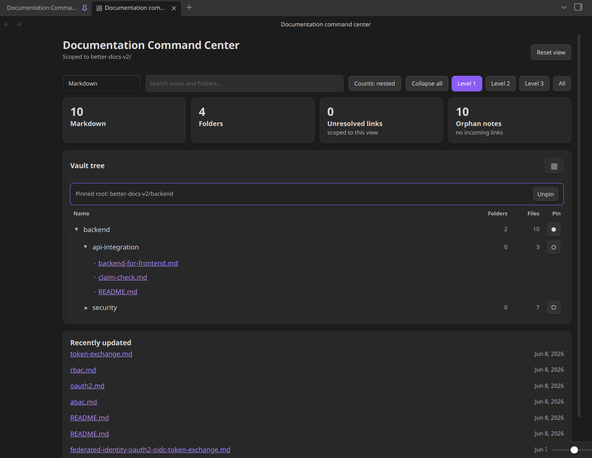
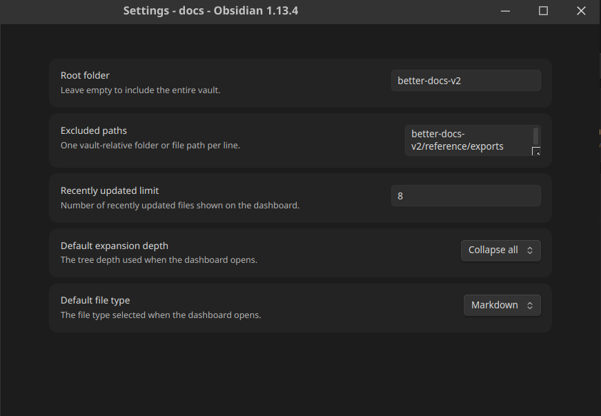

# Documentation Command Center

Documentation Command Center is a native Obsidian dashboard for seeing, searching, and navigating a documentation vault from one place.

It works offline and does not require Dataview, JavaScript queries, telemetry, or a cloud service.

## Features

- Vault tree with Collapse all, Level 1–3, and All expansion controls.
- Search by filename and path.
- Markdown, attachments, media, PDF, Excalidraw, Draw.io, and all-file filters.
- Nested or direct folder/file counts.
- Pin a folder as the active dashboard root.
- Recently updated files.
- Unresolved-link and orphan-note metrics for Markdown views.
- Lightweight image, audio, and video gallery with keyboard navigation.
- Native Obsidian handoff for Markdown, PDF, Excalidraw, Draw.io, and unsupported files.
- Safe quick actions for new notes, new folders, graph view, and refresh.

## Install

1. Copy `main.js`, `manifest.json`, and `styles.css` into:
   `.obsidian/plugins/documentation-command-center/`
2. Reload Obsidian.
3. Enable **Documentation Command Center** in **Settings → Community plugins**.
4. Open **Documentation Command Center: Open dashboard** from the command palette or click the ribbon icon.

## Settings

Open **Settings → Community plugins → Documentation Command Center** to configure:

- Root folder. Leave empty to scan the entire vault.
- Excluded vault-relative paths, one per line.
- Number of recently updated files to display.

Dashboard filters, search, pinning, and gallery selection are session state and reset when the view is reopened.

## Development

Requirements: Node.js 18+ and npm.

```bash
npm install
npm run dev       # watch build
npm run build     # production build
npm run sync:local # build and install into a local vault for testing
npm run lint
npm test
```

The generated `main.js` is a release artifact and is intentionally ignored by Git.

For local testing, `sync:local` copies the release artifacts into the configured development vault at `/mnt/work/workspace/docs/.obsidian/plugins/documentation-command-center/`. Update that path in `package.json` if your vault is elsewhere, then reload the plugin in Obsidian.

## Screenshots

### Dashboard overview

The dashboard brings vault navigation, health metrics, search, filtering, and recently updated notes into one view.



### Gallery view

The gallery provides keyboard navigation and previews for images, media, and other supported vault files.


### Settings

Configure the root folder, excluded paths, recent-note limit, default expansion depth, and default file type.



### Note hover preview

Native Obsidian note links retain their path tooltip and hover preview behavior.


## Release

The release tag must exactly match the version in `manifest.json` without a leading `v`. Attach `main.js`, `manifest.json`, and `styles.css` to the GitHub release.

The intended repository is `akhileshu/documentation-command-center`.

Before submitting to the community catalog, review the [Obsidian plugin guidelines](https://docs.obsidian.md/Plugins/Releasing/Plugin+guidelines) and [developer policies](https://docs.obsidian.md/Developer+policies).

## Prototype migration

The original DataviewJS implementation and visual design notes remain under `00 - Command Center` as migration reference material. They are not required at runtime; the native plugin is the supported implementation.

## License

0-BSD. See [LICENSE](LICENSE).
