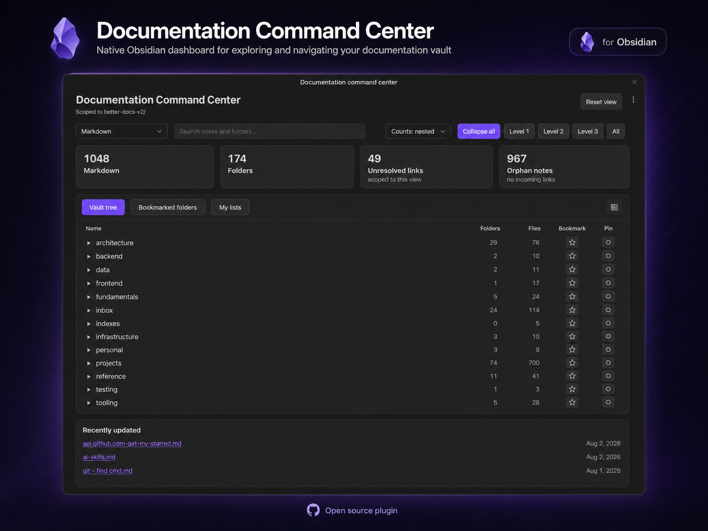
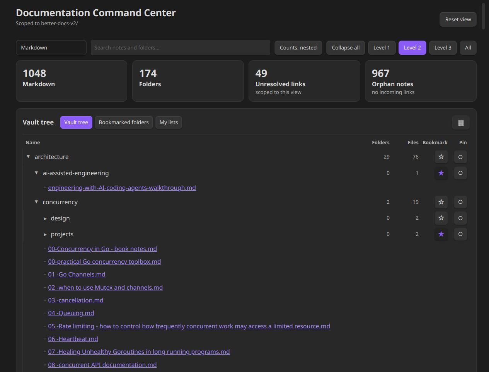
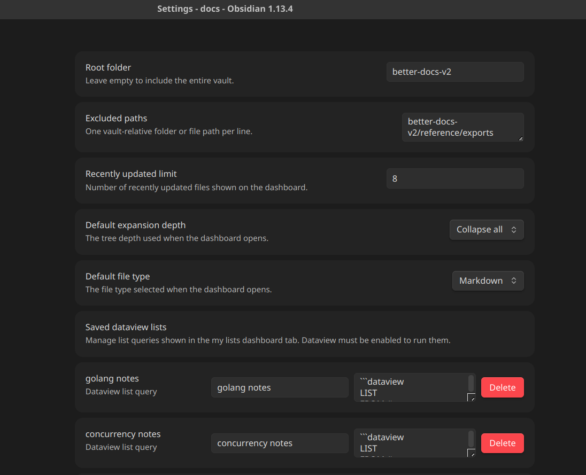
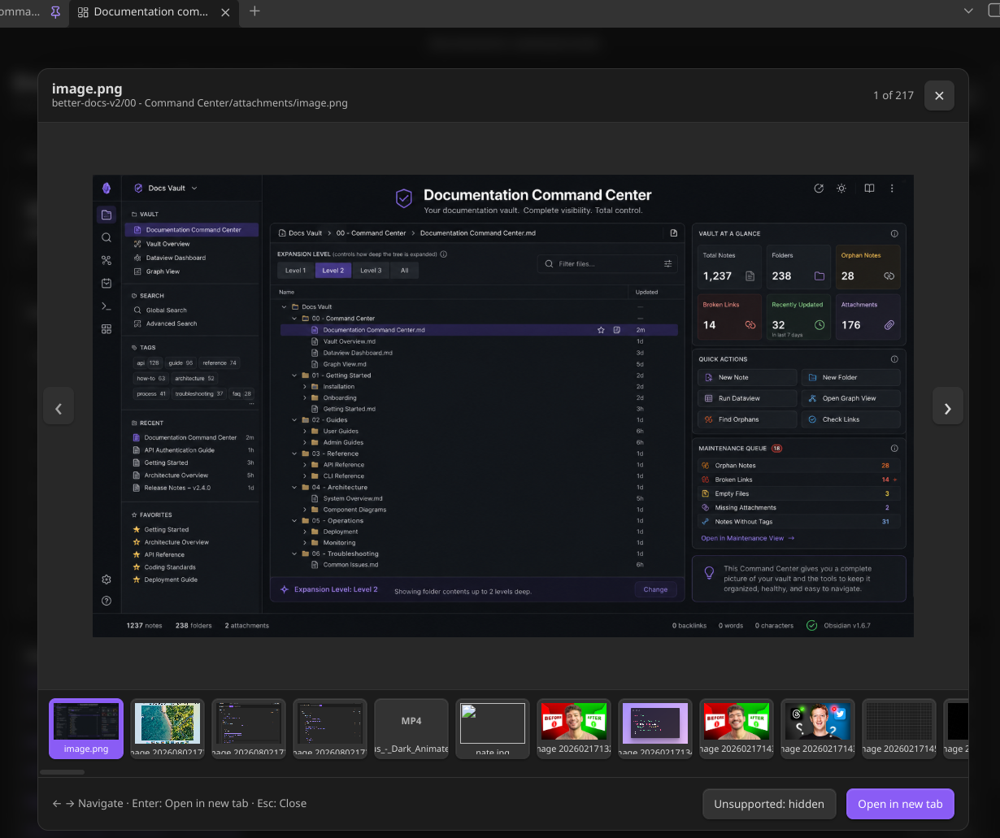
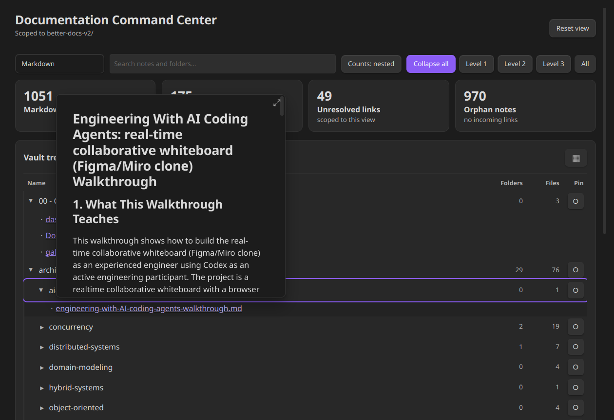

# Documentation Command Center



Documentation Command Center is a native Obsidian dashboard for exploring, searching, and navigating a documentation vault from one place.

The core dashboard works locally and offline. It does not require Dataview, JavaScript queries, telemetry, or a cloud service. Dataview is an optional integration used only by the **My lists** tab.

## Features

- Browse the vault through a collapsible folder tree.
- Switch between **Vault tree**, **Bookmarked folders**, and **My lists** tabs.
- Bookmark multiple folders and keep those bookmarks across plugin reloads.
- Search by note name and folder path.
- Filter Markdown, attachments, images, video, audio, PDF, Excalidraw, Draw.io, or all files.
- Toggle direct or nested folder/file counts.
- Expand the tree to a chosen depth or collapse and expand all levels.
- Pin a folder as the temporary root for the current dashboard session.
- View recently updated files.
- Review unresolved links and orphan notes in Markdown views.
- Open supported files through native Obsidian links and hover previews.
- Preview images and media in a lightweight gallery with keyboard navigation.
- Save and manage Dataview `LIST` queries from plugin settings.

## Tabs and saved lists

### Vault tree

Shows the configured vault scope and exposes the complete folder hierarchy. Each folder can be bookmarked or pinned as the active temporary root.

### Bookmarked folders

Shows files contained by saved folder bookmarks using the same tree, search, filter, count, gallery, and navigation experience as **Vault tree**. Bookmarks are stored in Obsidian plugin data and are updated automatically when folders are renamed or deleted.

### My lists

**My lists** is optional and requires the Dataview community plugin to be enabled. Create saved lists in **Settings → Community plugins → Documentation Command Center**. The first version supports the following form:

```dataview
LIST
FROM #go
SORT file.name ASC
```

Each saved list has a title and query. Select a title in the tab to render its matching files through the shared dashboard tree. `SORT file.name DESC` is also supported. Invalid or unsupported queries show an inline error without affecting the other tabs.

## Install

### Install from Obsidian Community Plugins

For the normal user installation:

1. Open **Settings → Community plugins**.
2. Select **Browse** and search for **Documentation Command Center**.
3. Select **Install**, then **Enable** the plugin.
4. Open **Documentation Command Center: Open dashboard** from the command palette or the ribbon icon.

No manual file copying is required when installing through Obsidian’s plugin browser.

### Install from GitHub or a release

For a manual install from a GitHub release or a locally built plugin:

1. Copy `main.js`, `manifest.json`, and `styles.css` into:
   `.obsidian/plugins/documentation-command-center/`
2. Reload Obsidian.
3. Enable **Documentation Command Center** in **Settings → Community plugins**.
4. Open **Documentation Command Center: Open dashboard** from the command palette or the ribbon icon.

Dataview is only needed if you want to use **My lists**.

## Settings

Open **Settings → Community plugins → Documentation Command Center** to configure:

- Root folder. Leave empty to include the entire vault.
- Excluded vault-relative paths, one per line.
- Recently updated file limit.
- Default expansion depth.
- Default file type.
- Saved Dataview list titles and queries.

Bookmarks and saved lists are persisted in Obsidian’s plugin data. Search, filters, pinning, selected tab, expansion state, and gallery selection are session state and reset when the dashboard view is reopened.

The dashboard enumerates vault files locally through Obsidian so it can support configured root folders, exclusions, attachments, media, bookmarks, and saved list results. The configured scope and exclusions are applied before rendering, and no vault data is sent to a network service.

## Screenshots

### Dashboard tabs and bookmarks

The dashboard provides vault navigation, health metrics, search, filtering, recently updated notes, expansion controls, folder counts, bookmarks, pins, and the three navigation tabs.



### Settings

The settings interface brings together vault scope, excluded paths, recently updated limits, default tree behavior, file type preferences, and saved Dataview lists in one place.



### Gallery view

The gallery provides keyboard navigation and previews for images, media, and other supported vault files.



### Note hover preview

Native Obsidian note links retain their path tooltip and hover preview behavior.



## Development

Requirements: Node.js 18+ and npm.

```bash
npm install
npm run dev        # watch build
npm run build      # production build
npm run sync:local # build and install into the configured local vault
npm run lint
npm test
```

The generated `main.js` is a release artifact and is intentionally ignored by Git.

For local testing, `sync:local` copies `main.js`, `manifest.json`, and `styles.css` into:

```text
/mnt/work/workspace/docs/.obsidian/plugins/documentation-command-center/
```

Update the destination in `package.json` if your development vault is elsewhere, then reload the plugin in Obsidian.

## Release

The release tag must exactly match the version in `manifest.json` without a leading `v`. Attach `manifest.json`, `main.js`, and `styles.css` as individual release assets.

Each GitHub release should include a concise description of the user-visible changes, fixes, compatibility notes, and any required plugin dependencies such as Dataview for **My lists**.

The intended repository is `akhileshu/documentation-command-center`.

Before submitting to the community catalog, review the [Obsidian plugin guidelines](https://docs.obsidian.md/Plugins/Releasing/Plugin+guidelines) and [developer policies](https://docs.obsidian.md/Developer+policies).

## Compatibility notes

- The settings tab continues to use the compatibility-oriented `PluginSettingTab` API so the plugin can retain its current minimum Obsidian version.
- The archived prototype under `00 - Command Center` is reference material and is not part of the supported native plugin runtime.

## Prototype migration

The original DataviewJS implementation and visual design notes remain under `00 - Command Center` as migration reference material. They are not required at runtime; the native plugin is the supported implementation.

## License

0-BSD. See [LICENSE](LICENSE).
